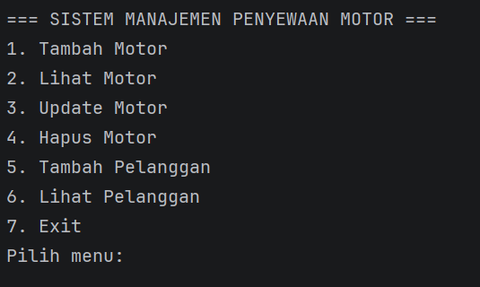

# Sistem Manajemen Penyewaan Motor
Nama: (Ade Pasiha Tangke Allo)
NIM: (2409106109)
Kelas: (C2'24)

## Deskripsi
Program ini dibuat untuk mengelola penyewaan motor menggunakan konsep Object Oriented Programming (OOP) di Java.

Program menggunakan ArrayList untuk menyimpan data dan memiliki fitur CRUD.

## Fitur Program
- Tambah Data Motor
- Lihat Data Motor
- Update Data Motor
- Hapus Data Motor
- Tambah Data Pelanggan
- Lihat Data Pelanggan

## Class yang Digunakan
1. Motor
2. Pelanggan
3. Main

## Struktur Program
- Motor.java
- Pelanggan.java
- Main.java

## Tampilan Program

### Menu Program

### Tambah Motor
